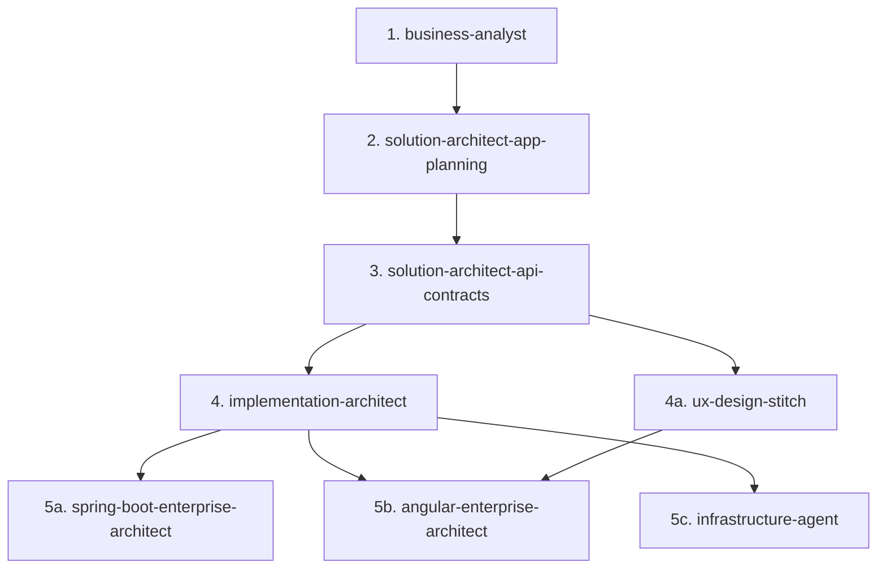

# Codex Skills — Vibe Code The Right Way

> **Stop vibe-coding without a plan. This repo enforces a staged, contract-driven workflow — from business idea to production deployment — using specialized AI skills (agents).**

📖 **Medium Article:** https://medium.com/@nikhil8.jsg/vibe-code-the-right-way-with-skills-00e4bb55cda9

---

## 🔗 Proof of Concept & Related Repos

| Link | Description |
|------|-------------|
| 🚀 **OpenBlog** | https://github.com/Nikhil8bph/openblog — Production reference implementation built entirely through this workflow |
| 💻 **PoC Blog App** | https://github.com/Nikhil8bph/poc-blog-app — Minimal PoC demonstrating the full skill chain end-to-end |
| 🛠️ **Codex-Skills (this repo)** | https://github.com/Nikhil8bph/codex-skills — Reusable skill definitions for any project |
| 📖 **Medium Article** | https://medium.com/@nikhil8.jsg/vibe-code-the-right-way-with-skills-00e4bb55cda9 — Full philosophy & walkthrough |

> The **PoC is present in** [`poc-blog-app`](https://github.com/Nikhil8bph/poc-blog-app) and the production-grade example is [`openblog`](https://github.com/Nikhil8bph/openblog). Clone either to see the `docs/` + `contracts/` artifacts generated by the skills below.

---

## 🎯 Why This Repo?

Most AI code-gen fails because it jumps straight to code. This repo flips that:

1.  **Requirements first** (BRD with personas, FRs, Given-When-Then)
2.  **Architecture second** (ADRs, topology, DB, security — no endpoints yet)
3.  **Contracts third** (OpenAPI / AsyncAPI / JSON Schema — single source of truth)
4.  **Implementation plan fourth** (5-tier WBS + traceability matrix)
5.  **Code last** (Spring Boot / Angular / Infra — strictly contract-driven)

Each stage is enforced by a dedicated skill. No stage can be skipped.

---

## 🔄 Workflow



Defined in [`AGENTS.md`](./AGENTS.md) — the single source of truth for execution order and rules.

---

## 🤖 Skills / Agents

| # | Skill | Location | Input | Output | Purpose |
|---|-------|----------|-------|--------|---------|
| 1 | **business-analyst** | `.codex/skills/business-analyst/` | Product idea / vision | `docs/01-business-requirements.md` | Discovery grill (6 dimensions), MoSCoW scoping, FR matrix, user stories with GWT acceptance criteria, NFRs, risk register |
| 2 | **solution-architect-app-planning** | `.codex/skills/solution-architect-app-planning/` | BRD (01) | `docs/02-application-development-plan.md` | ADRs, system topology (Gateway+Eureka, PG/Mongo/Redis/MinIO/OpenSearch/Kafka), DB schemas, security/rate-limit, resiliency (circuit breaker/DLQ), integrations. No endpoints — those are stage 3 |
| 3 | **solution-architect-api-contracts** | `.codex/skills/solution-architect-api-contracts/` | BRD + ADP (01+02) | `docs/03-api-contract-integration-specification.md` + `contracts/` | OpenAPI 3.1, AsyncAPI 3.0, JSON Schema, envelope standards, per-endpoint auth/rate-limit, Razorpay/FCM/APNs/MailHog contracts |
| 4 | **implementation-architect** | `.codex/skills/implementation-architect/` | BRD + ADP + API Spec (01+02+03) | `docs/04-implementation-strategy.md` | 5-tier WBS (Phase→BLI→Task→Activity→Subtask), traceability matrix (FR→Service→Contract→Task), Definition of Done |
| 4a | **ux-design-stitch** | `.codex/skills/ux-design-stitch/` | BRD + ADP + Contracts (read-only) | `docs/DESIGN.md` | Google Stitch MCP — one UX scope per run, screen inventory, states (loading/empty/error/offline), a11y, action→contract mapping. Status must be `Ready for Angular` before frontend work |
| 5a | **spring-boot-enterprise-architect** | `.codex/skills/spring-boot-enterprise-architect/` | TASK-* from 04 + contracts | Backend code (Maven modules) | One `TASK-*` per run, Maven-only, reverse-DNS packages, Controller→Service→Facade→Repository, Flyway/Liquibase, JWT+RBAC, outbox pattern |
| 5b | **angular-enterprise-architect** | `.codex/skills/angular-enterprise-architect/` | TASK-WEB-* + DESIGN.md + contracts | Frontend code (`src/app/...`) | Standalone + OnPush + signals + `inject()`, 4 files per component (`.ts/.html/.scss/.spec.ts`), lazy features, functional interceptors/guards |
| 5c | **infrastructure-agent** | `.codex/skills/infrastructure-agent/` | All docs + contracts | Docker Compose, observability, backup/restore | Single-host Compose, health-gated startup, Kafka/Mongo/OpenSearch/SeaweedFS, OTEL/Prometheus/Grafana/Loki/Tempo. Never invents services beyond contracts |
| — | **task-browser-verification** | `.codex/skills/task-browser-verification/` | — | — | Placeholder / stub for future browser E2E verification |

> All skills treat `docs/01-*.md`, `docs/02-*.md`, `docs/03-*.md`, and `contracts/` as **read-only**. Only status rows in `docs/04-implementation-strategy.md` and `docs/DESIGN.md` may be mutated by downstream skills.

---

## 📁 Repository Structure

```
codex-skills/
├── .codex/
│   ├── config.toml              # MCP servers: Stitch, Playwright, Chrome DevTools
│   └── skills/
│       ├── business-analyst/
│       ├── solution-architect-app-planning/
│       ├── solution-architect-api-contracts/
│       ├── implementation-architect/
│       ├── ux-design-stitch/
│       ├── spring-boot-enterprise-architect/
│       ├── angular-enterprise-architect/
│       ├── infrastructure-agent/
│       └── task-browser-verification/
├── docs/                        # Generated per-project (not committed here)
│   ├── 01-business-requirements.md
│   ├── 02-application-development-plan.md
│   ├── 03-api-contract-integration-specification.md
│   ├── 04-implementation-strategy.md
│   └── DESIGN.md
├── contracts/                   # Generated per-project (OpenAPI/AsyncAPI/JSON Schema)
├── AGENTS.md                    # Workflow rules — must be followed by all agents
└── README.md
```

---

## 🚀 Getting Started

### 1. Use this repo as a skill source

Clone or reference `.codex/skills/` in your project (Codex / opencode compatible):

```bash
git clone https://github.com/Nikhil8bph/codex-skills.git
# copy .codex/skills/* into your project's .codex/skills/
```

### 2. Configure MCP (optional but recommended)

`config.toml` declares:

- **Google Stitch** — UX generation (`X-Goog-Api-Key = STITCH_API_KEY`)
- **Playwright** (Docker) — E2E browser verification
- **Chrome DevTools** (npx) — headless debugging

Set `STITCH_API_KEY` as env var before running the `ux-design-stitch` skill.

### 3. Run the workflow in order

```
1. Invoke business-analyst          → confirm BRD
2. Invoke solution-architect-app-planning → confirm ADP
3. Invoke solution-architect-api-contracts → confirm contracts
4. Invoke implementation-architect  → confirm WBS
4a. Invoke ux-design-stitch         → get DESIGN.md = Ready for Angular
5.  Invoke spring-boot / angular / infrastructure (one TASK-* per run, parallel allowed)
```

> See each `SKILL.md` for detailed preconditions, checklists, and DoD.

---

## 📏 Key Rules (from AGENTS.md)

- **Maven only** — root `pom.xml` with `packaging=pom`, wrapper at backend root. No Gradle.
- **Package structure** — reverse-DNS base + `config/security/controller/service/facade/repo/entities/dtos/mapping/exception/validation/event/client`.
- **Angular** — 4 files per component, no inline templates/styles, colocated specs.
- **One TASK-* per agent run** — sibling tasks need separate runs.
- **No invention** — if a requirement/endpoint/contract is missing, go back to the owning stage.
- **Search before create** — reuse shared utilities, follow SOLID/clean code.

---

## 👤 Author

**Nikhil Sharma**

- 📧 Email: [nikhil8.bph@gmail.com](mailto:nikhil8.bph@gmail.com)
- 💼 LinkedIn: https://www.linkedin.com/in/nikhilsharmabph/
- 🐙 GitHub: https://github.com/Nikhil8bph

---

## 📄 References

- 📖 Medium: https://medium.com/@nikhil8.jsg/vibe-code-the-right-way-with-skills-00e4bb55cda9
- 🚀 OpenBlog: https://github.com/Nikhil8bph/openblog
- 💻 PoC Blog App: https://github.com/Nikhil8bph/poc-blog-app
- 🛠️ Codex-Skills: https://github.com/Nikhil8bph/codex-skills

---

## 📝 License

MIT — feel free to fork, adapt, and use the skills in your own projects. Attribution appreciated.
